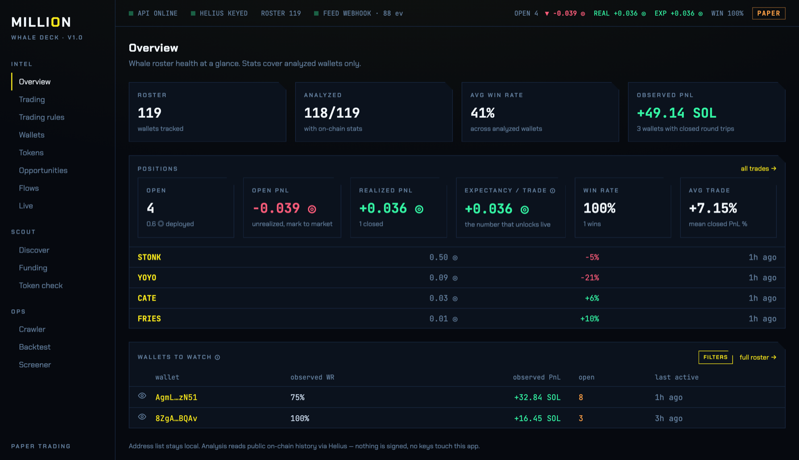
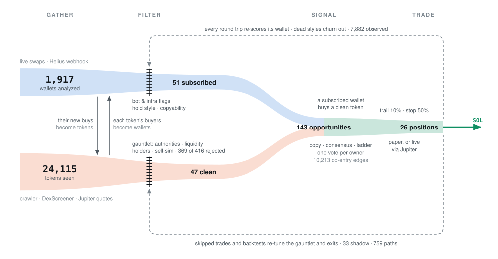

# million

A self-hosted Solana whale tracker that grew into a trading loop. It watches
wallets, finds more wallets through the tokens they buy, filters out bots and
rugs, and turns what's left into trade signals — paper first, live if you choose.



> **Experimental. Provided as is, with no warranty.** This is a research tool,
> not a money printer, and nothing in it is financial advice. Trading meme coins
> can lose you everything you put in. If you trade real money with it, that is
> your decision and your risk: the authors are not responsible for any loss.
> Start on paper.

## How it works

<picture>
  <source media="(prefers-color-scheme: dark)" srcset="docs/loop-dark.svg">
  
</picture>

<sub>Counts from the first instance. Ribbon height is proportional to log(count): the narrowing is the filter.</sub>

Everything feeds everything.

- **Wallets find tokens.** Every swap a subscribed wallet makes arrives through a
  Helius webhook within seconds. A new buy puts that token on the table.
- **Tokens find wallets.** For any token, the crawler pulls its size buyers,
  analyzes them, and absorbs the ones that look like traders rather than bots,
  routers or distributors.
- **Two filters sit in the middle.** Wallets are flagged on behaviour (bot and
  infrastructure patterns, hold style, copyability). Tokens run a gauntlet:
  mint and freeze authority, liquidity, market cap, holder concentration,
  deployer history, a Jupiter sell simulation, RugCheck.
- **Signals.** When a subscribed wallet buys a token that passed, that's an
  opportunity: *copy* (one sized buy), *consensus* (several distinct owners in a
  window, with buyers outweighing sellers) or *ladder* (repeated small buys that
  add up). Wallets that keep entering the same tokens together are merged into
  one owner, so a cluster of addresses gets one vote.
- **Trades.** Opportunities open positions with a trailing stop, a hard stop and
  a breakeven ratchet, sized from your bankroll.
- **The loop back.** Every round trip a wallet completes re-scores it, and wallets
  with styles that don't pay get churned out. Trades the filters skipped keep
  being priced as shadow positions, and cached candle paths feed the backtester,
  so the rules can be tested against what actually happened.

## What's in the deck

| Section | Page | What it's for |
|---|---|---|
| Intel | Overview | roster health at a glance, open positions |
| | Trading | open and closed positions, expectancy |
| | Trading rules | entry signals, exits, sizing, safety switches |
| | Wallets | the roster: import, analyze, subscribe, per-wallet history |
| | Tokens | everything seen, what the roster holds right now |
| | Opportunities | every signal, and why it did or didn't trade |
| | Flows | net buying and selling per token across the roster |
| | Live | the raw event stream |
| Scout | Discover | size buyers of any token |
| | Funding | who funded a wallet, to follow operators across addresses |
| | Token check | run the gauntlet on any mint |
| Ops | Crawler | the perpetual wallet ⇄ token crawl, with budgets |
| | Backtest | exit rules scored on cached candle paths |
| | Screener | batch token screening |

## Requirements

- **Node 22** (`nvm use` reads `.nvmrc`)
- **A Helius API key.** The free tier is enough to start: [dashboard.helius.dev](https://dashboard.helius.dev).
  The key is yours and never leaves your machine except to call Helius.
- **A public URL for webhooks** (optional, see [Live feed](#live-feed))
- [mprocs](https://github.com/pvolok/mprocs) (optional) to run everything in one terminal

## Setup

```sh
nvm use         # Node 22 from .nvmrc, in the same terminal as the rest
npm install     # builds packages/shared, creates apps/api/.env and the database
                # then add your HELIUS_API_KEY to apps/api/.env
mprocs          # or: npm run dev
```

The deck is at http://localhost:5173.

To start, paste a list of wallet addresses into **Wallets** (JSON, a plain list
or free text all work), analyze them and subscribe to the ones you want to
follow. Or open **Discover** on a token you know and pull its buyers.

## Live feed

Helius can push you every transaction your subscribed wallets make. There are
two ways to receive them.

**Websocket (no setup).** Leave `WEBHOOK_URL` empty. The API dials out to Helius
and subscribes wallet by wallet. It works from localhost, but it tops out at
**25 wallets**.

**Webhook (no cap).** Helius posts transactions to a public URL, so your machine
needs one. This is the extra step, and it is deliberate: running a tunnel is a
small commitment, and anyone who does is probably going to watch the book too.

### Cloudflare Tunnel (what this repo uses)

You need a domain on Cloudflare.

1. In the Cloudflare dashboard, go to **Zero Trust → Networks → Tunnels** and
   create a tunnel. Copy its token.
2. Add a public hostname, for example `million.yourdomain.com`, pointing to
   `http://localhost:3001`.
3. In `apps/api/.env`:
   ```sh
   WEBHOOK_URL="https://million.yourdomain.com"
   WEBHOOK_SECRET="some-long-random-string"   # Helius sends it back; other POSTs get 401
   TUNNEL_TOKEN="<the tunnel token>"
   ```
4. Install `cloudflared` (`brew install cloudflared`). The `tunnel` pane in
   `mprocs.yaml` reads the token from `.env`.

The API creates and maintains the Helius webhook for you, and replaces it if
Helius ever disables it.

### ngrok (alternative)

ngrok gives you one free static domain, so no domain of your own is needed:

```sh
ngrok http --url=your-name.ngrok-free.app 3001
```

Set `WEBHOOK_URL="https://your-name.ngrok-free.app"`. Watch the free tier's
monthly limits: this project started on ngrok and moved away after the quota ran
out and every delivery started coming back 403. The API notices a dead feed and
falls back to the websocket, but it's capped at 25 wallets.

### What the tunnel exposes

Only `/api/live/webhook`. Any request that arrives through a tunnel or proxy
(`cf-ray` or `X-Forwarded-*` headers) is refused on every other route, because
the API has no login and its config endpoint can switch on live trading. Keep it
that way.

## Trading

### Paper (default)

Every opportunity that passes your rules opens a simulated position. Fills are
priced at market plus the **measured** round-trip cost from a Jupiter quote for
that token, so the paper book pays roughly what live would.

**Stops only fire while the API is running.** Nothing protects a position
on-chain while the app is off: if your machine sleeps for a day, every stop that
should have fired in that day fires at once when it wakes, at whatever the price
is by then. That goes for live positions too.

### Live

One switch in `apps/api/.env` decides paper or live:

```sh
EXECUTOR=local
EXECUTOR_KEYPAIR_PATH=~/.million/keypair.json   # solana-keygen JSON, keep it outside the repo
```

With `EXECUTOR=local` set, **every opportunity that clears your rules is bought
with real SOL**, with no further confirmation. Leave it unset and the same
opportunities trade on paper. The deck's top bar shows which mode is running
(`PAPER` or a pulsing `◉ LIVE`). Restart the API after changing it.

Swaps go through Jupiter and are signed locally; your keys never leave your
machine. The executor enforces its own hard limits under whatever the strategy
asks for: `LOCAL_MAX_TRADE_SOL` (default 0.25 ◎ per trade) and
`LOCAL_MIN_BALANCE_SOL` (default 0.05 ◎ kept for fees).

### Developer fee

Live swaps carry a **0.25% fee** (25 bps) that goes to the maintainer, through
Jupiter's platform fee, paid in SOL. It is charged on each swap, so a full round
trip pays it twice. The same fee is applied to paper fills so the paper book
matches what live would return.

Set `FEE_BPS` in `apps/api/.env` to lower it, or `FEE_BPS=0` to turn it off. It
can't be set higher than 25. If the fee can't be collected for any reason, the
swap goes through without it: the fee is never the reason a trade, and
especially an exit, fails.

## Research tools

`tools/` holds research and check scripts:

| Script | What it answers |
|---|---|
| `check-accounting.mjs` | Is every SOL number right? Worked examples, and with `--chain` real swaps checked against the validator's balances |
| `monte-carlo.mjs` | What does the book look like at 30 days, 180 days, 1 and 3 years, and how wide is that spread |
| `decision-clocks.mjs` | How many trades until the edge question and the fill question can be answered |
| `kill-criterion.mjs` | A stop rule for the whole strategy that actually triggers when there's no edge |
| `exit-rank-by-resolution.mjs` | Whether candle resolution changes which exit rule wins (it does) |

## Security notes

- **The API has no authentication.** It is meant to be reached from your own
  machine. Don't expose port 3001 directly.
- **The deck listens on your whole network** (`host: true` in
  `apps/web/vite.config.ts`) so you can check it from your phone. On a network
  you don't trust, remove that line: anyone who can reach port 5173 can change
  your trading rules.
- Keep the executor keypair outside the repo. `.gitignore` blocks common keypair
  file names, but don't rely on it.

## Layout

```
apps/api         NestJS API — Prisma + SQLite, Helius, Jupiter, DexScreener
apps/web         React deck — Vite, TanStack Router and Query, Tailwind
packages/shared  zod schemas and types shared by both
tools/           research and check scripts
docs/            README images
```

## License

[MIT](LICENSE). Provided as is, without warranty: see the status note at the top.
